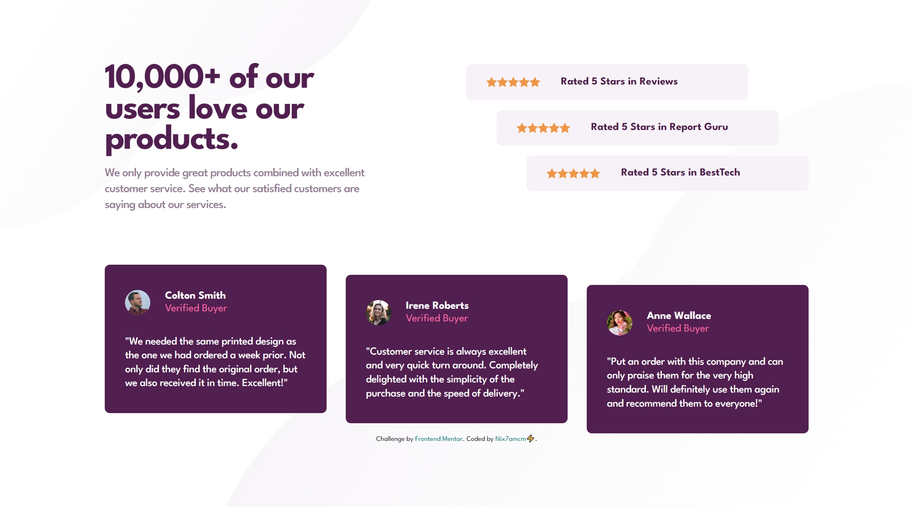
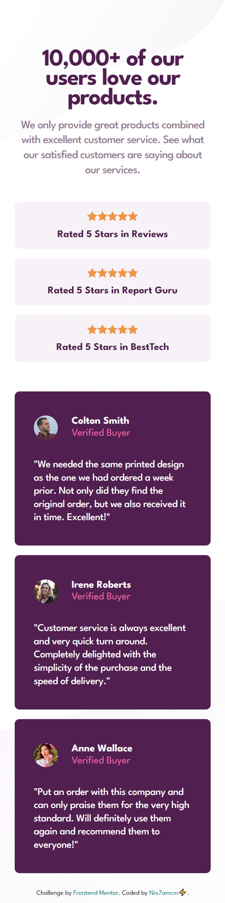

# Frontend Mentor - Social proof section solution

This is my solution to the [Social proof section challenge on Frontend Mentor](https://www.frontendmentor.io/challenges/social-proof-section-6e0qTv_bA).

## Table of contents

- [Overview](#overview)
  - [Challenge Requirements](#challenge-requirements)
- [Screenshots](#screenshots)
- [Links](#links)
- [My process](#my-process)
  - [Built with](#built-with)
- [Author](#author)

---

## Overview

👩🏻‍💻 [Frontend Mentor](www.frontendmentor.io) challenges help you improve your coding skills by building realistic projects.

⚡ This challenge had the aim of working on CSS layout skills by using grid and/or flexbox to build a responsive social proof section.

🚀 I built this using HTML and CSS, with the help of [Figma](https://www.figma.com) for the design. I mostly used flexbox for this, with grid just for the desktop body layout. I found it very helpful for practicing my flexbox skills in learning how to apply the align-self property, as opposed to individually offsetting the position of elements! This definitely made it easier and quicker to modify for the mobile design. I know I could improve the accessibility with better sectioning of the elements, instead of all divs.

### Challenge Requirements

Users should be able to:

- View the optimal layout for the section depending on their device's screen size

---

## Screenshots

---

## Links

- Solution URL: [frontendmentor.io/solutions/social-proof-section-using-grid-and-flexbox-SdhpOy6lhK](https://www.frontendmentor.io/solutions/social-proof-section-using-grid-and-flexbox-SdhpOy6lhK)
- Live Site URL: [nix7amcm.github.io/FEM-social-proof-section/](https://nix7amcm.github.io/FEM-social-proof-section/)

---

## My process

### Built with

- Semantic HTML5 markup
- CSS custom properties
- Flexbox
- CSS Grid
- Figma

---

## Author

- Website - [Nix7amcm](https://github.com/Nix7amcm)
- Frontend Mentor - [@Nix7amcm](https://www.frontendmentor.io/profile/Nix7amcm)
- LinkedIn - [amcm-8807](https://www.linkedin.com/in/amcm-8807/)

---
---